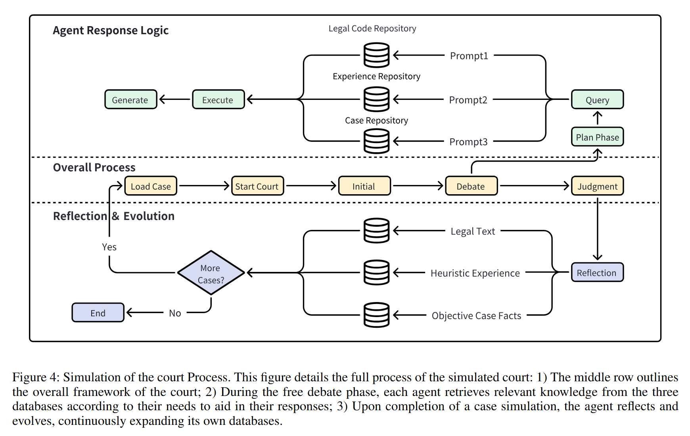
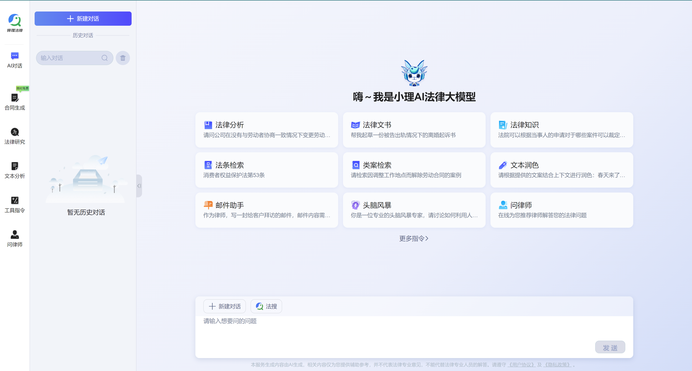

<h1 id="agentcourt" style="display: inline;">
  
  AgentCourt: 模拟法庭与对抗性进化律师智能体
</h1>

## 演示动图


上面的 GIF 展示了模拟法庭环境中律师智能体的对抗性进化过程。

---

## 论文
如需深入了解我们的研究方法和发现，请参阅我们的学术论文：
[AgentCourt: 模拟法庭与对抗性进化律师智能体](https://arxiv.org/abs/2408.08089)

## 视频演示
观看系统的语音讲解演示视频，请访问我们的哔哩哔哩视频链接：
[在哔哩哔哩观看视频演示](https://www.bilibili.com/video/BV1aXpUe3E6A?t=2323.7)
   
## 目录

1. [概述](#概述)
2. [主要特点](#主要特点)
3. [研究亮点](#研究亮点)
4. [安装](#安装)
5. [数据下载](#数据下载)
6. [法庭流程](#法庭流程)
7. [训练](#训练)
8. [测试](#测试)
9. [评估](#评估)
10. [代码可用性](#代码可用性)
11. [贡献](#贡献)
12. [引用](#引用)
13. [联系方式](#联系方式)

## 概述

AgentCourt 是一个创新的模拟系统，旨在通过大型语言模型（LLMs）驱动的自主智能体复制整个法庭审判过程。该项目的目标是使律师智能体能够通过广泛的法庭流程模拟来学习和提高其法律技能。

## 主要特点

- **完整法庭模拟**：包括法官、原告律师、辩护律师和其他参与者作为自主智能体。
- **对抗性进化方法**：律师智能体通过模拟法律案例学习和进化。
- **LLM 驱动的智能体**：利用先进的语言模型驱动智能体交互和决策。
- **持续学习**：智能体从基于真实世界知识的模拟法庭案例中积累经验。

## 研究亮点

- 模拟了 1000 个对抗性法律案例（相当于现实世界十年的经验）。
- 进化后的律师智能体在处理法律任务方面显示出持续改进。
- 专业律师评估了模拟结果，确认在以下方面有所进步：
  - 认知敏捷性
  - 专业知识
  - 逻辑严谨性

## 安装

要安装所需的依赖项，请运行以下命令：

```bash
pip install -r requirements.txt
```

## 数据下载

本项目使用的数据集可在 Hugging Face 上获取：
[AgentCourt 数据集](https://huggingface.co/datasets/youzi517/AgentCourt)

## 法庭流程



上图展示了 AgentCourt 中模拟的详细法庭流程。

## 训练

按照以下步骤训练模型：

1. **修改配置文件**：使用便捷的大模型接口修改 `example_role_config.json` 文件。我们使用了 ERNIE-Speed-128K。如果您无法访问 API，可以使用我们配置文件中指定的本地模型，并将 `llm_type` 更改为 `offline`。

2. **运行模拟**：执行以下命令模拟 1000 个真实案例：

    ```bash
    python main.py
    ```

## 测试

执行测试：

1. **禁用反思和总结**：在代码中关闭 `reflect_and_summary()`。

2. **模拟测试数据**：用所需的智能体（进化后的律师或基础模型）替换原告和被告，进行比较实验。

3. **获取测试结果**：运行模拟并收集结果。

## 评估

### 1. 人工评估

我们邀请了一组中国法律专家评估测试案例。


### 2. 自动评估

您可以参考以下链接进行多任务模型评估：

[https://github.com/open-compass/LawBench/](https://github.com/open-compass/LawBench/)


评估脚本在提供的链接中有详细说明。将进化后的律师与适当的提示相结合，最大限度地利用三个数据库，在自动评估任务上取得良好性能。

## 代码可用性

**注意：** 本项目的代码目前正在整理和完善中。我们预计将在下周内将其上传到此存储库。请稍后再查看更新。感谢您的耐心等待和对我们工作的兴趣。

## 贡献

我们欢迎对 AgentCourt 项目的贡献。在提交拉取请求之前，请阅读我们的贡献指南。


## 引用

如果您在研究中使用 AgentCourt，请引用我们的论文：

```
@misc{chen2024agentcourtsimulatingcourtadversarial,
      title={AgentCourt: Simulating Court with Adversarial Evolvable Lawyer Agents}, 
      author={Guhong Chen and Liyang Fan and Zihan Gong and Nan Xie and Zixuan Li and Ziqiang Liu and Chengming Li and Qiang Qu and Shiwen Ni and Min Yang},
      year={2024},
      eprint={2408.08089},
      archivePrefix={arXiv},
      primaryClass={cs.CL},
      url={https://arxiv.org/abs/2408.08089}, 
}
```
## 致谢

我们要向 Deli Legal 团队表示感谢，感谢他们在 AI 驱动的法律技术领域做出的创新贡献。他们的智能法律系统（可在 [Deli Legal AI](https://www.delilegal.com/ai) 查看）为我们的 AgentCourt 工作提供了宝贵的参考和灵感。对于那些有兴趣进一步了解 Deli Legal 进展的人，可以在 [Deli Legal 研究论文](https://arxiv.org/abs/2408.00357) 中找到详细信息。



上图提供了 Deli Legal 系统的概览，展示了其通过先进 AI 技术增强法律流程的能力。

---

我们感谢所有贡献者和合作伙伴提供的支持和见解，这些对 AgentCourt 项目的发展和成功至关重要。

## 联系方式

我们很高兴您对 AgentCourt 项目感兴趣。如果您认为我们的工作有价值，请考虑给我们一个 ⭐️（星标）以示支持。您的鼓励对我们持续改进和扩展该项目至关重要。

如果您有任何问题、建议或希望贡献代码，请通过 GitHub Issue 系统联系我们。我们期待与您合作，共同推动法律场景中 LLM 驱动的智能体技术的发展。

感谢您的关注和支持！
