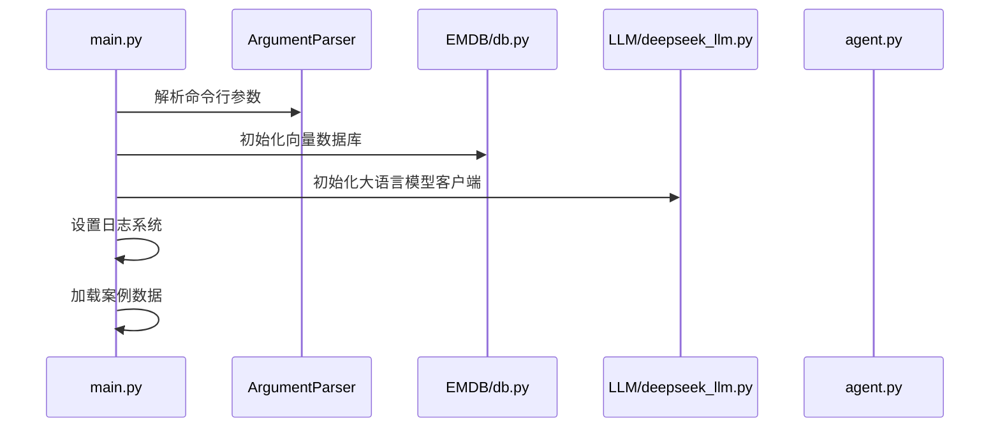
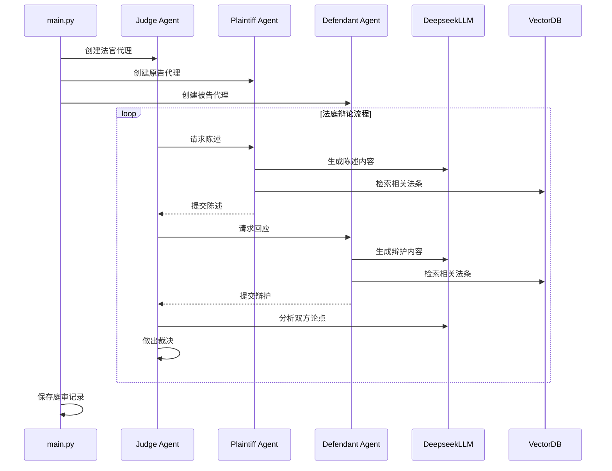
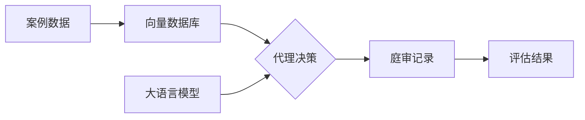
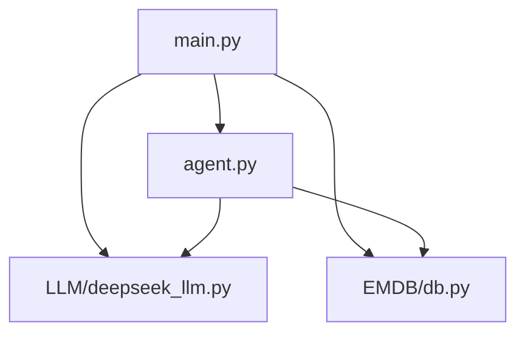

# AgentCourt 项目结构与执行流程分析

## 项目目录结构

```
AgentCourt-main/
├── data/                   # 案例数据目录
│   └── validation.jsonl    # 验证集案例数据
│
├── LLM/                    # 大语言模型交互模块
│   ├── deepseek_llm.py     # DeepSeek API 封装实现
│   └── zhipuai_client.py   # 智谱 API 客户端
│
├── EMDB/                   # 嵌入式向量数据库模块
│   └── db.py               # ChromaDB 数据库管理实现
│
├── agent.py                # 智能代理实现（法官、原告、被告等角色）
├── main.py                 # 主程序入口文件
├── test.py                 # API 测试脚本
├── example_role_config.json # 角色配置示例文件
└── requirements.txt        # 项目依赖库清单
```

## 核心文件功能说明

| 文件名 | 主要功能 |
|-------|---------|
| `main.py` | 程序入口，负责初始化环境、加载配置、创建代理并运行模拟法庭 |
| `agent.py` | 定义各类法庭角色代理，实现代理间交互和决策逻辑 |
| `EMDB/db.py` | 向量数据库管理，存储法律条文和案例，提供语义检索功能 |
| `LLM/deepseek_llm.py` | DeepSeek大语言模型API封装，处理提示词构建和响应解析 |

## 代码执行流程

### 1. 初始化阶段



### 2. 法庭模拟阶段



### 3. 数据流向



## 关键代码依赖关系



## 优化建议

### 执行顺序优化
1. **数据加载优先级调整**：
   - 先初始化数据库连接
   - 再加载并验证案例数据
   - 最后创建代理实例

2. **向量数据库填充**：
   ```python
   # 在 main.py 的 load_case_data 方法中添加
   for case in case_data:
       self.db.add_to_case(case["id"], case["content"])
       # 同时添加相关法条
       for law in case.get("related_laws", []):
           self.db.add_to_law(law["id"], law["content"])
   ```

3. **错误处理增强**：
   - 添加数据库连接异常处理
   - 增加API调用超时和重试机制
   - 实现代理交互的容错逻辑

### 潜在问题修复
- 确保 `save_court_log` 方法正确缩进在类定义内
- 检查所有数据库方法是否被正确调用
- 验证角色配置文件格式是否符合预期


---------------------------------------
---------------------------------------
---------------------------------------
## 当前版本更新

1. **大模型优化**：
   - 将原文心一言模型替换为DeepSeek模型
   - 性能优化仍在进行中

2. **可视化界面**：
   - 新增基于Streamlit的交互式界面
   - 界面功能调试阶段

## 项目执行步骤

1. 安装依赖库：
   ```bash
   pip install -r requirements.txt
   ```

2. 准备API访问：
   - 注册DeepSeek账号
   - 申请API密钥（可充值10元测试）

3. 运行主程序：
   ```bash
   python main.py
   ```